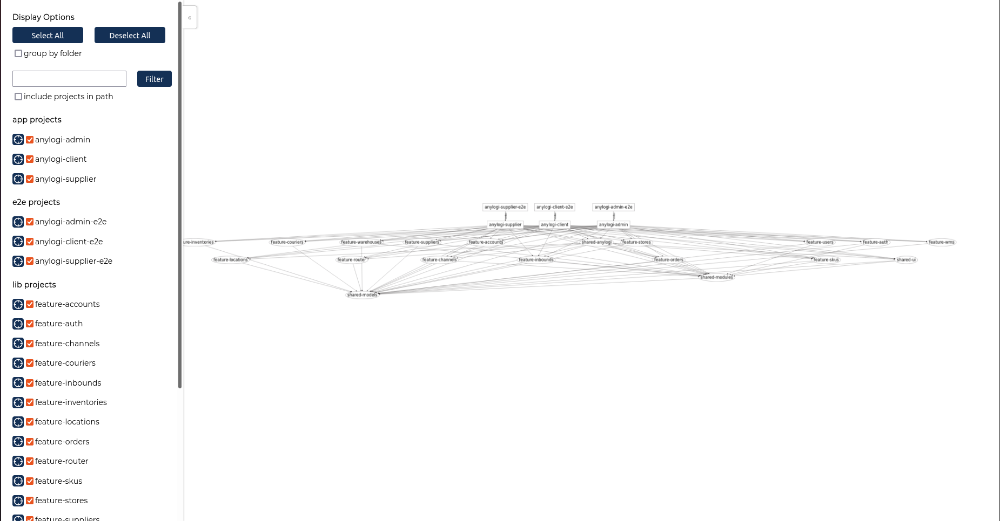
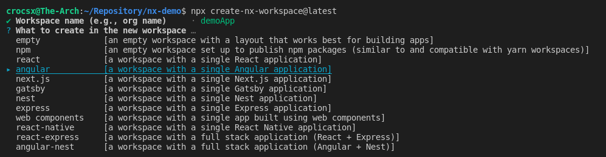
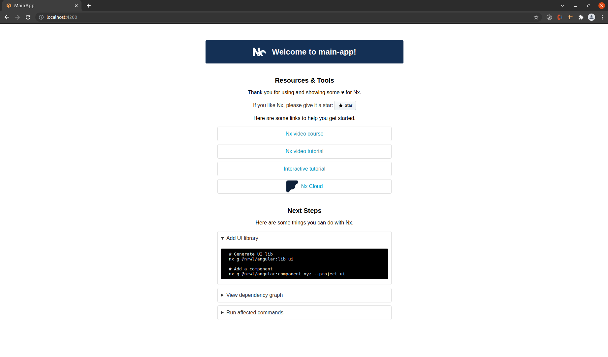
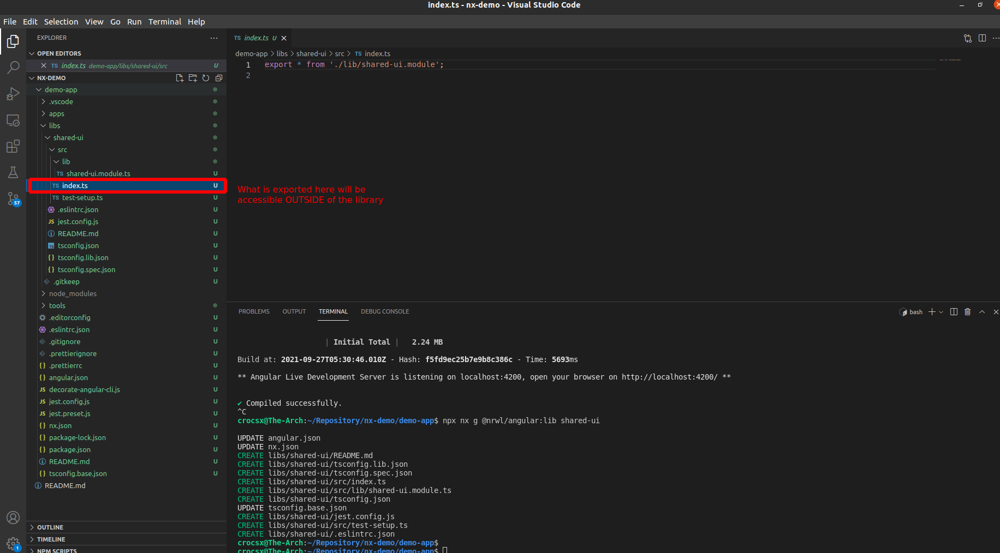
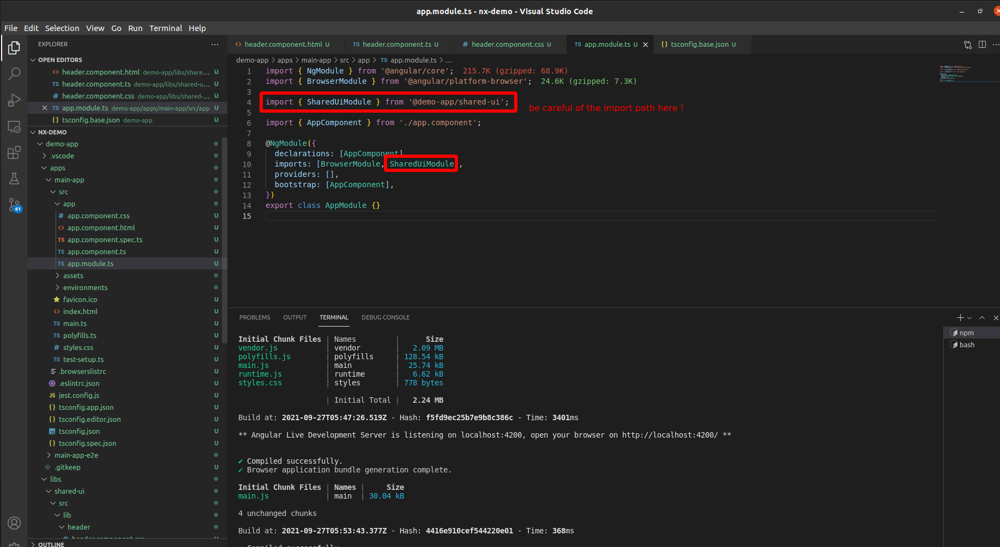
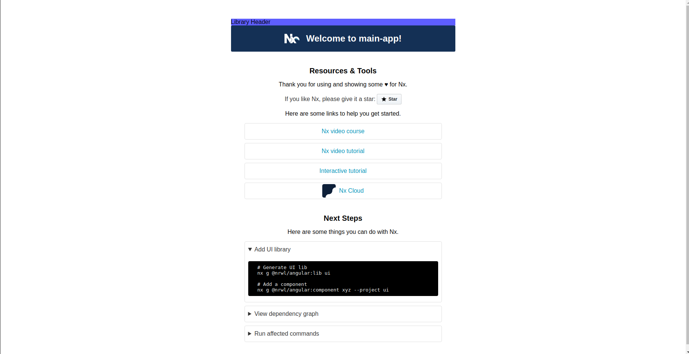
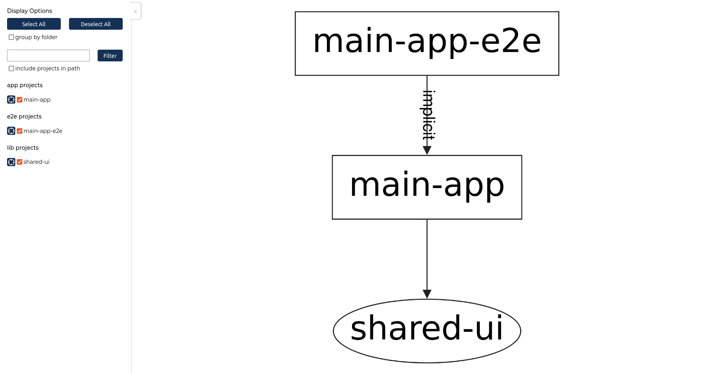

Welcome to my blog post, this is Giacomini Federico. I work as a Front-end Developer for the [AnyLogi](https://anymindgroup.com/products/anylogi/) team. Today I would like to introduce you to [Nx](https://nx.dev/), a “Smart, Extensible Build Framework” for building your Web Applications. 

**This post will go through the following points:**
 
 1. A Quick introduction to Nx and Monorepos
 2. Why did we choose Nx for AnyLogi
 3. Create a simple Nx Monorepo
 3. Conclusion

 
**1. A Quick introduction to Nx and Monorepos**
 
Nx is a framework that allows you to architect, test, and build your project at any scale with the most popular modern Front-end frameworks like React and Angular, and Back-end ones like NestJs or Express. To make this possible, Nx comes shipped with a large toolset that simplifies your Monorepo management. If you are unfamiliar with Monorepo, it is basically a version-controlled code repository that holds many projects and libraries. The Monorepo approach has several benefits over a common one. Here are a few:

 - **Shared code** - It is already possible with properly fragmented repositories to share common logic across the whole company, organization, or project. Monorepo makes it even easier to improve the DRY(ness) of your code as we can not just reuse common patterns, components, and types across different front-end libraries but between Front-end and Back-end as well. 

- **Atomic changes** - When making changes that would affect other projects/libraries, (like an API definition), all those changes can be applied and tracked on a single branch/commit, without having to track down all dependent projects and additional coordination efforts necessary.

- **Standardization** - It is easier to standardize code and tooling across the teams. You can impose branch policies to keep your main branch clean, limit access to specific branches, enforce naming guidelines, include code reviewers, and enforce best practices while sharing the same linter and prettier configurations on multiple projects and libraries in your repository.

- **Release management** - You can handle all your release pipelines once without having to set up over-complicated deployment sequences across repositories using a clear and defined flow that every team can follow and avoiding the deployment knowledge within each team.

- **Easier refactoring and dependencies** - Direct access to all micro-services makes refactoring the code in a Monorepo and changing the overall code structure much quicker than moving code between repositories. By updating the dependencies on the same repository it is easier to avoid version conflicts between libraries.

But why use Nx, and not just create a simple angular or react workspace? What sets Nx apart is the very large toolset that it brings to the table, helping you across all the facets of building your Monorepo. Here are some of the useful features of Nx : 
 
- **Cached and Custom Operations** - Nx will allow you to define and cache operations avoiding the same code being built multiple times. When making changes to a library, you can automatically execute operations (like building, testing, linting…) on affected projects, greatly reducing build times or pipeline executions.
 
 - **Cross framework components** - Another great feature coming with Nx is the possibility to build micro Front-ends and share the same component across React and Angular applications. You will code your component logic once, and use it as is in your project. Additionally, all projects and libraries will be created with testing tools like Cypress, Storybook, and Jest.
 
 - **Easy to manage dependencies** - Nx also extends some eslint rules to allow you to carefully decouple and isolate your library and dependencies. With the tags system and dependencies tree, you can enforce the dependencies flow you like across your projects/libraries and Nx will help you find circular dependencies or dependencies that make no sense (for example a library depending on a project). To have a quick glimpse of your project structure, you can generate a dependencies graph of the workspace.

 - **A Configurable CLI** - Nx comes with a robust CLI that can be configured to work with different tools and even different languages providing commands to operate and manage all the chunks of your codebase. For example, If you are familiar with angular CLI, Nx will extend those commands to make them work with the whole NX Monorepo.

- **Metadata-driven** - Everything in Nx comes with metadata to enable tool-ability. The default values, validations, auto-completion, and other settings are all defined in a schema, instead of in code. You can also use the [Nx Editor Plugin](https://marketplace.visualstudio.com/items?itemName=nrwl.angular-console) and change his configuration with those files.

**2. Why did we choose Nx for AnyLogi**

Anylogi is a Logistics Management Platform connecting brands with WMSs, warehouses, and delivery companies around the world. The Front end is built in Angular, with a NestJs application serving as a gateway to our Back-end. Since the application requires connection to multiple WMS with different guidelines and requirements, we decided to make the logic decoupled as much as possible. This would also come in handy since our app consists of a variety of user types with different permissions and functionality.
 
In previous projects I worked on, the basic approach to handle such cases was to create an Angular directive hiding or showing some UI elements, with conditions in code for calling or not some API. But such an approach makes scalability very difficult. The more User Roles added, the more conditions and logic were added to the FE making it hard to maintain and test the multiple cases. Another issue we faced was when creating customized user roles functionality and experiences. In some cases, we wanted error messages for the admins to be more detailed than for users. In other, we would show advanced steps or fields for admins while simplifying the same process to users. All those changes would add additional conditions and fragment our application in parts that were not working together in harmony.

With Anylogi we decided to follow the Monorepo approach. Instead of having a single project with a hard-to-grasp logic and conditions all over the place, or multiple repositories that would need to work as one, we built a single Monorepo with Nx to handle our various projects and libraries. It makes things quicker and easier when sharing common logic, modules, and features across our workspace while maintaining the ability to easily customize the experience of a specific user type. 

We created 3 projects based on our user roles requirements, and desired experience. We separated some common components used in those 3 projects (like the headers, logins pages, etc..) in UI libraries that are used across all projects. Finally, We separated our feature logic into various feature libraries, that way, it would be simple to add or remove functionality when needed. 

Thanks to Nx cached operations, we can modify a single Front-end app and deploy it independently of the others, or modify a library, rebuild the dependencies and deploy only that library-affected apps. 

One thing we missed and might add later is the addition of our NestJS gateway to this mono repository. Right now, our Back-end Gateway is existing on a different repository, which creates some code duplication but it would work all the same if not better if we added it in our Monorepo.

**3. Create A Simple Nx Monorepo**

In this last part, we will create a simple Nx Monorepo with a project depending on a library. We are going to use angular, but you are free to set up React or View. 
Be sure to replace by what you want the content between bracket `{ }`
 
Let’s start by creating our workspace

    npx create-nx-workspace@latest

You will have to choose the name of the workspace, what to create in it, and additional options based on what you selected. I just chose angular for this example, but you are free to add what you want, or add an additional project/library later on. You will also be prompted to use Nx Cloud, I will not go over it in this blog, but you can find more information on the Nx website [Nx Cloud](https://nx.app/)
 
You can test the project by navigating in the workspace and launch the project (those names are the ones you set previously) :

    cd ./{workspaceName}/
    npx nx serve {applicationName}
    
   you should see on `http://localhost:4200/` the default Nx start page: 
    

Let’s now add a library :

    npx nx g @nrwl/angular:lib {libraryName}

This will generate a new folder under `libs` named like your library and will contain the code defining your library. By default, this will result in an angular module named like the library. But Nx will also add additional configuration in your workspace, the most important part being the following.

If you go to the `tsconfig.base.ts` at the root of the project, you will see a new line added that should look like (with the name you selected) :

    "paths": {
        "@{applicationName}/{libraryName}": ["libs/{libraryName}/src/index.ts"]
    }
 
This absolute import path points to your library definition. Anything exported in this file will be sharable across your workspace.

For Nx to work correctly, and your project to be clean, **ANYTHING** that you want to export from the library should be present in this file. Additionally, **EVERY** project that uses this library must **ONLY** import and use what is defined in this file.

Let's add a component to this library. We will use the Nx CLI to generate the boilerplate the same way Angular CLI does it. I usually use [Atomic Design](https://bradfrost.com/blog/post/atomic-web-design/) to organize my components, but for the sake of simplicity, let’s just add it at the root of the library.

    cd ./libs/{libraryName}/src/lib/
    npx nx g @nrwl/angular:component {componentName}

Voila! We created a component the same way we usually do and it is already declared in the library module. Let's just add some code to this component and add it on the top of the Nx demo page. I will create a simple text header.

in the `.html`

    

       Library Header
    

in the `.css` (or whatever per-processor you chose)

    .topnav {
       background-color: rgb(94, 94, 255);
       overflow: hidden;
       width: 100%;
    }

Double-check if the component is correctly added to the library module using the name you have previously chosen for your library and component. In my case it looks like this : 

    `@NgModule({
        imports: [CommonModule],
        exports: [HeaderComponent],
        declarations: [HeaderComponent],
    })
    export  class  SharedUiModule {}`

index.ts
`export  *  from  './lib/shared-ui.module';`

Check also that the module is exported in the library entry point (index.ts). If yes, let's import our library into our main project. 

Navigate to the `AppModule` of our application and import our library module by using the **ABSOLUTE PATH**

Now simply add our component in our project `app.component.html` and you should see it appear :

You can now also use 

    npx nx dep-graph
to generate the simple dependency graph of our project :

 
You can find this very simple Monorepo here [https://github.com/Crocsx/dev.to/blog-posts/introduction-to-nx-and-monorepo/exemple](https://github.com/Crocsx/blog-posts/introduction-to-nx-and-monorepo/exemple)

**4. Conclusion**

There is a lot more you can set up on NX to make your project easier to manage and we only scratched the surface. I hope this short blog post gives you enough information to understand the basics and the possible applications of such a tool for your future project. I hope to go more in detail in a future blog post and showcase much more functionality. Until then, have a great one!

