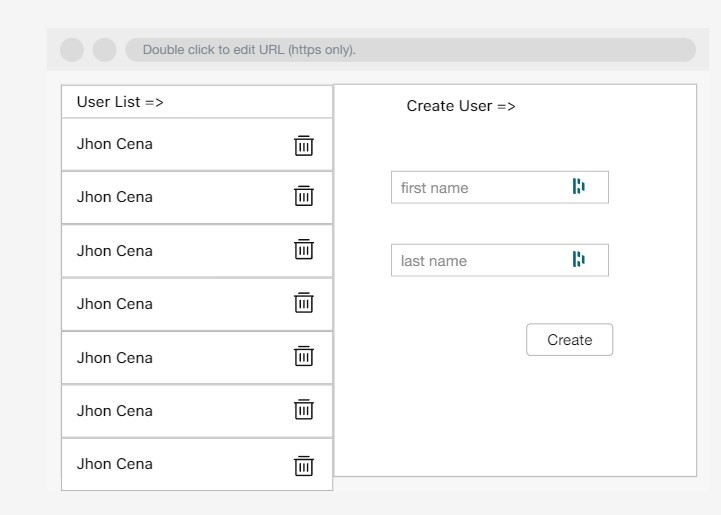
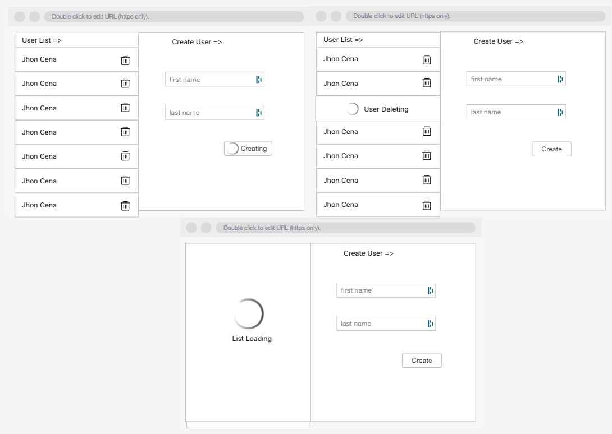

In this article, I would like to propose a solution for handling the state of multiple actions inside your Ngrx store. I will assume you already know the basics of Ngrx or other Redux pattern-based state management tools and are also pretty familiar with Angular and Typescript, as I will go pretty quick on the details.

One of the most common situations when using a reactive state management library is handling asynchronous API. The most common approach to tackling async operations is creating three actions for each possible outcome (request/success/failure) and making a side effect handling each of them. It is also common to have some flags in our state that track the store's current state. 

Here is a classic example in NGRX very similar to the one in the "example repository" :

`actions.ts`
```
export const userAddRequest = createAction(
  '[User] User Add Request',
  props<{username: string}>()
);

export const userAddSuccess= createAction(
  '[User] User Add Success',
  props<{username: string, id: number}>()
)

export const userAddFailure = createAction(
  '[User] User Add Failure',
  props<{message: string}>()
)
```

`effect.ts`
```
  userAddRequest$ = createEffect(() =>
    this.actions$.pipe(
      ofType(userActions.userAddRequest ),
      exhaustMap(({username}) =>
        this.userService.add({username}).pipe(
          map(response => userActions.userAddSuccess(response)),
          catchError((error: any) => of(userActions.userAddFailure(error))))
      )
    )
  );

  userAddSuccess$ = createEffect(
    () =>
      this.actions$.pipe(
        ofType(userActions.userAddSuccess),
        tap(() => {
          alert('User Add Succeeded');
        })
      ),
    { dispatch: false }
  );

  userAddFailure$ = createEffect(
    () =>
      this.actions$.pipe(
        ofType(userActions.userAddFailure),
        tap(() => {
          alert('User Add Failed');
        })
      ),
    { dispatch: false }
  );
```

`reducer.ts`
```
export interface State {
  users: User[];
  isLoading: boolean;
  isLoadingSuccess: boolean;
  isLoadingFailure: boolean;
}

const reducer = createReducer(
  initialState,
  on(userActions.userAddRequest, (state) => ({isLoading: true})),
  on(userActions.userAddSuccess, (state, {user}) => ({users: state.users.concat(user) , isLoading: false, isLoadingSuccess: true})),
  on(userActions.userAddFailure, (state, {user}) => ({user, isLoading: false, isLoadingFailure: true})),
);
```

`selector.ts` 
```
export const getLoaded = (state: State) => state.isLoadingSuccess;
export const getLoading = (state: State) => state.isLoading;
```

This works nicely in many scenarios, but I found this approach to be fairly limited when we would like to give more advanced feedbacks to users.

Let's imagine the following UI : 



We have a list of users on the left and a form to create a user on the right. This page effectuates three operations on our User Store :

`getUsers`
`deleteUser`
`createUser`

Out of those three operations, we would like to display a specific loader on the page :

When users are being loaded, we would like to show a loader on the list.
When a user is being deleted, we would like to show 
a loader ONLY on the user that is being deleted.
When a user is being created, we would like to show 
a loader on the Create Button.



A single flag would not work correctly since all those operations are contained in the same store module. We would have to set a flag for each operation inside the store or add some variable in our component to hold which process is currently executed.

But this is troublesome and would add a lot of logic; what if we could track the state of each Action independently?

Tracking The State of any NGRx Action

To make things easier, we can create a unique `loader` store in our application that we use for the single purpose of tracking actions and their state. It allows us to track the current state of any dispatched Ngrx action that we wish to follow.

First, we replaced the booleans flags with a simple enum instead. It is quicker to change a single property and less prone to situations where a flag is forgotten in a wrong state like `{isLoading: true, isSucceded: true}`:

```
export enum ActionState {
  LOADING = 'LOADING',
  SUCCEEDED = 'SUCCEEDED',
  FAILED = 'FAILED',
}
```

From here, the idea is to consider "async" actions as a single `set`. Each Action in a `set`  would share a key with others, and we would use it to update the state of that operation in our `loaders` store.

One way to do this is to create a wrapper over our Actions using [`createAction with method`](https://ngrx.io/api/store/createAction#usage-notes). It will allow us to add some `metadata` alongside the Action definition. This `metadata` can be anything.

```
export const userAddSetkey = '[User] User Add Key';
export const userAddRequest = createAction(
  '[User] User Add Request',
  function prepare(payload: {username: string, password: string}) {
    return withLoader({ [userAddSetkey]: ActionState.LOADING }, payload);
  }
);
export const userAddSuccess = createAction(
  '[User] User Add Success',
  function prepare() {
    return withLoader({ [userAddSetkey]: ActionState.SUCCEEDED }, null);
  }
);
export const userAddFailure = createAction(
  '[User] User Add Failure',
  function prepare(payload: { message: string }) {
    return withLoader({ [userAddSetkey]: ActionState.FAILED }, payload);
  }
);
```
You can assign an anonymous function; we went with `prepare` because it is more similar to the [`redux prepare`](createAction | Redux Toolkit (redux-toolkit.js.org)). This function adds additional information to the payload and the actions when they are initialized.

As you may note, we also wrote a simple wrapper `withLoader` around our payload. This method will add a property key that will be the same for each Action in our application that implements the tracking. That property will be helpful to know if the dispatched Action contained a state tracker or not.

```
export const LOADER_KEY = '@ngrx-custom-loader';

export type WithLoader<T> = T & {
  [LOADER_KEY]: { [k: string]: ActionState };
};

export function withLoader<T>(loader: Partial<{ [k: string]: ActionState }>, payload?: T) {
  return Object.assign(payload || {}, { [LOADER_KEY]: loader }) as WithLoader<T>;
}
```

When creating Action using `withLoader`, we will access a new property alongside `type` and `payload` that will store the `action` key and the `state`. We define this new Action structure as `WithLoader<T>`.

if you now log an action that implements the above structure, it will result like the following :

```
    {
        @ngrx-custom-loader: {'[User] User Add Key': 'LOADING'}
        type: "[User] User Add Request"
        payload: {username: 'jhon'}
    }
```

Finally, we need to make some use of those loader keys. We implemented a `loader` store that will save the `state` of all actions implementing `withLoader`.

`state.ts``
```
export interface State {
  actionState: Record<string, ActionState>;
}

export interface LoadersPartialState {
  readonly [LOADERS_FEATURE_KEY]: State;
}

export const initialState: State = {
  actionState: {},
};
```

 It starts empty `{}` and will grow every time an action is dispatched to look something like this. 

```
{
    '[Login] Login Key': 'SUCCEEDED',
    '[User] User Add Request': 'LOADING',
    ...
}
```

Our reducer will check if the current Action contains our custom property `LOADER_KEY` assigned above. If yes, we will store this action state; else, it will do nothing.

`reducer.ts`
```
export function reducer(
  state: State | undefined = initialState,
  action: Action | WithLoader<Action>
) {
  if (Object.prototype.hasOwnProperty.call(action, LOADER_KEY)) {
    const loader = (action as WithLoader<Action>)[LOADER_KEY];
    return {
      ...state,
      actionState: {
        ...state.actionState,
        ...loader,
      },
    };
  }
  return state;
}
```

And last, the selector will check the store content and return the state of a specific action. We can pass an array of Actions that we would like to know the state, and it will return a boolean if any of them is currently loading. You can implement the same for Failure, Success, etc., or just one that would give back the state. 

`selector.ts`
```
export const getIsLoading = (actions: string[] = []) =>
  createSelector(getLoadersState, (state) => {
    if (actions.length === 1) {
      return state.actionState[actions[0]] === ActionState.LOADING;
    }
    return actions.some((action) => {
      return state.actionState[action] === ActionState.LOADING;
    });
});

// We added an additional state INIT used when the operation has never been called. 
export const getLoadingState = (action: string) =>
  createSelector(
    getLoadersState,
    (state) => state.actionState?.[action] || ActionState.INIT;
  );
```
Let's use our tracking system :

We can now quickly implement our previous UI requirement :

assuming you create all Actions correctly, we can do 

```
    // The user are getting loaded
    this.store.dispatch(loadUsersList());
    this.usersLoading$ = this.store.pipe(
      select(getIsLoading([userListLoadSetKey]))
    );

    // A user is being delete
    // for this case you also need to store what user it getting deleted to show the feedback on the correct row.
    InDeletionUserId = userId;
    this.store.dispatch(deleteUser({ id: userId }));
    this.userDeleting$ = this.store.pipe(
      select(getIsLoading([userDeleteSetKey]))
    );

    // A user is being created
    this.store.dispatch(createUser({ id: accountId }));
    this.userCreating$ = this.store.pipe(
      select(getIsLoading([userAddSetKey]))
    );

    // Any of the above is loading
    this.isUserStoreLoading$ = this.store.pipe(
      select(
        getIsLoading([userListLoadSetKey, userDeleteSetKey, userAddSetKey])
      )
    );
```

By using `getLoadingState`, you can also track when an operation is finished; helpful in those rare cases where you would like to execute a side effect to Actions outside of an NGRx effect. For example, reset a form when a user is created :

```

  onSubmit() {
    this.form.controls.username.disable();
    this.store.dispatch(userAddRequest({ ...this.form.getRawValue() }));

    this.store
      .pipe(select(getLoadingState([userAddSetKey])))
      .pipe(
        takeWhile(
          (state) =>
            ![ActionState.SUCCEEDED, ActionState.FAILED].includes(state),
          true
        ),
        filter((state) => state === ActionState.SUCCEEDED),
        tap(() => this.form.controls.username.enable())
      )
      .subscribe();
  }
```


You can find a demo of this approach on the following [Stackblitz](https://stackblitz.com/edit/angular-ivy-cb5qv3?file=src/app/app.component.html) or [Repository](https://github.com/Crocsx/dev.to/tree/state-tracker/blog-posts/track-your-ngrx-actions-state/exemple/demo-app).



I hope I didn't go too fast and that this post was helpful. It works very fine on our project, but we might have overlooked some behaviors. One central flaw point that I didn't cover is clearing the loaders once in a while (on route navigation, for example) to avoid storing gigantic objects in your NGRx store. But this is only problematic if your project contains a lot of Action, and we currently only have 150 actions. Please feel free to comment and give feedback on such an approach. Also, do not hesitate to ask for clarification or points I passed over too quickly. 

Thank you, and see you in the next post!
